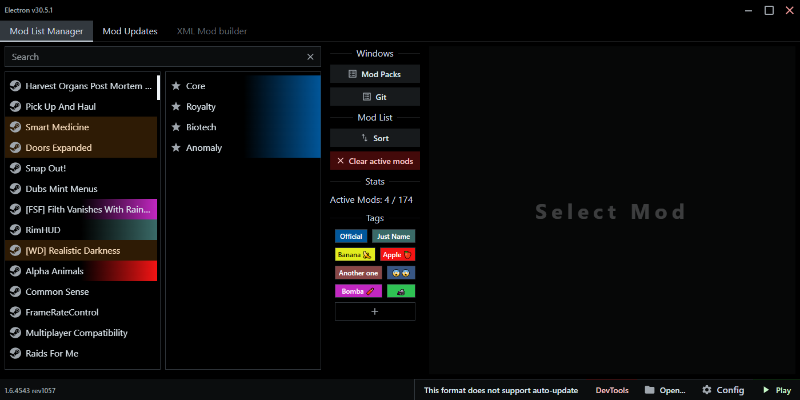

<h1 align="center">RimLauncher</h1>

  
  
  

  
  

  
  
  

  

---

## ⚠️ Security Notice
> This launcher is **not verified by Apple or Microsoft**.  
> On first launch, your system may show a warning.  

| macOS | Windows |
|-------|---------|
| **Message:** “App can’t be opened...”   **Fix:** Finder → Right-click → Open → Confirm (only once) | **Message:** “Windows protected your PC”   **Fix:** More info → Run anyway (only once) |

✅ These warnings do **not** mean RimLauncher is unsafe — they only appear because the app is not signed with a paid certificate.

---

## 🔍 Purpose
**RimLauncher** makes managing RimWorld mods easier with a clean and intuitive interface.  
Organize, update, and control your mods effortlessly.

---

## 🚀 Installation
Download the latest release from the [Releases](https://github.com/Inadequado4192/RimLauncher/releases) page and follow the installer instructions.

---

## ⚙️ Features
- 🔄 Enable or disable installed mods with a toggle  
- 🧩 Download and update mods directly from Git repositories
- 📜 View mod update history from Steam  
- 📦 Create and manage modpacks  
- 🏷️ Organize mods with custom tags  
- ✅ Import and export modpacks  

➡️ Future features are listed in the [ROADMAP.md](./ROADMAP.md).

---

## ℹ️ Note on Pirated Versions
RimLauncher **may work** with pirated versions of RimWorld, but this is **not tested or officially supported**.  
For full compatibility and support, we recommend using legitimate copies.

---

## 📦 Changelog
Check out all updates, fixes, and improvements in the [CHANGELOG.md](./CHANGELOG.md).
